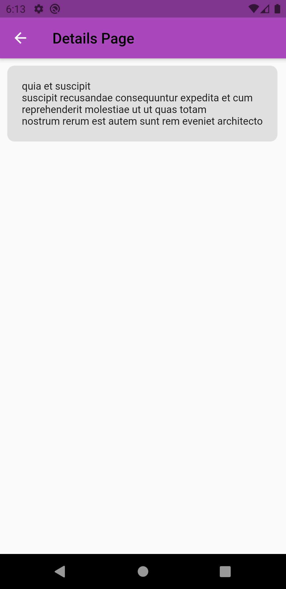

# Network Call Practice GCA

- In body, I created a column to place loading indicator and list view function.
- In list view function, I createa a sized box ang gave height of 85% of total height to prevent from overflow.
- Child of sized box was ListView and inside it I gave children a list of widget which was defined as empty list and widget was eventually added.

- http: ^0.13.2

## Screenshots
{ width=50% }
{ width=50% }

## Getting Started

This project is a starting point for a Flutter application.

A few resources to get you started if this is your first Flutter project:

- [Lab: Write your first Flutter app](https://flutter.dev/docs/get-started/codelab)
- [Cookbook: Useful Flutter samples](https://flutter.dev/docs/cookbook)

For help getting started with Flutter, view our
[online documentation](https://flutter.dev/docs), which offers tutorials,
samples, guidance on mobile development, and a full API reference.
